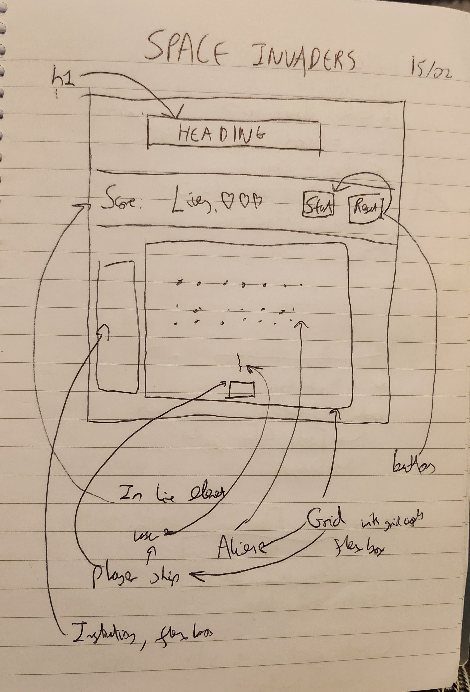
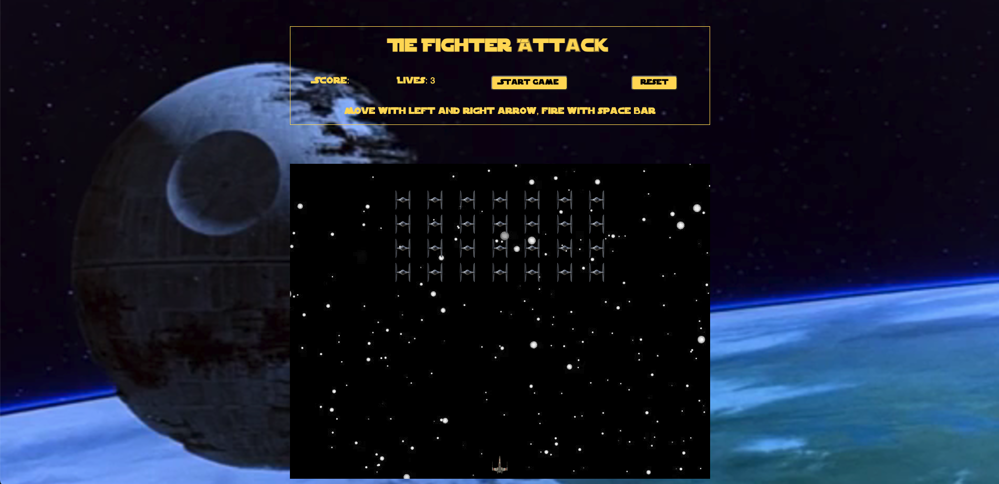
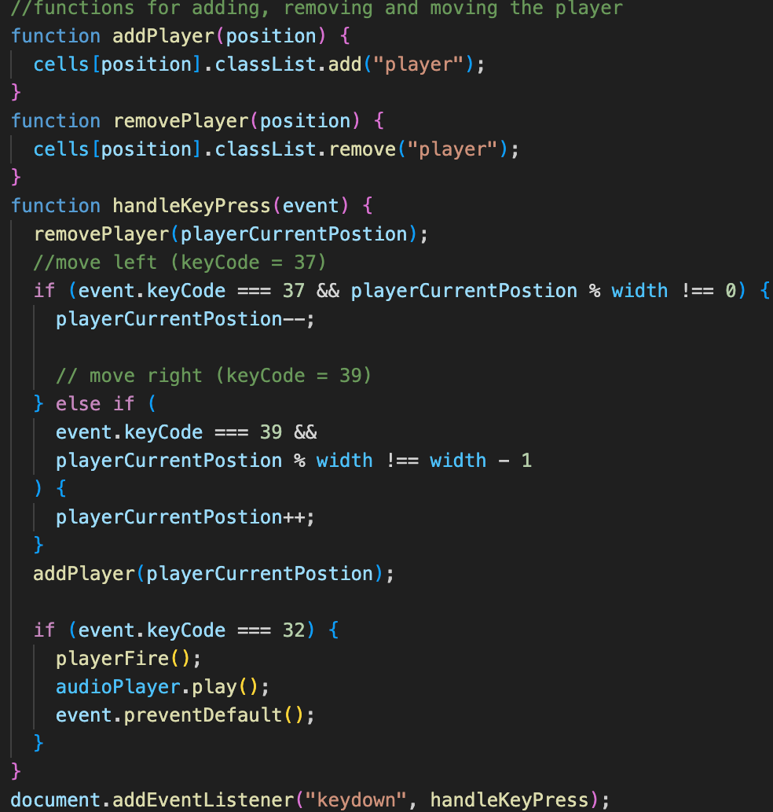
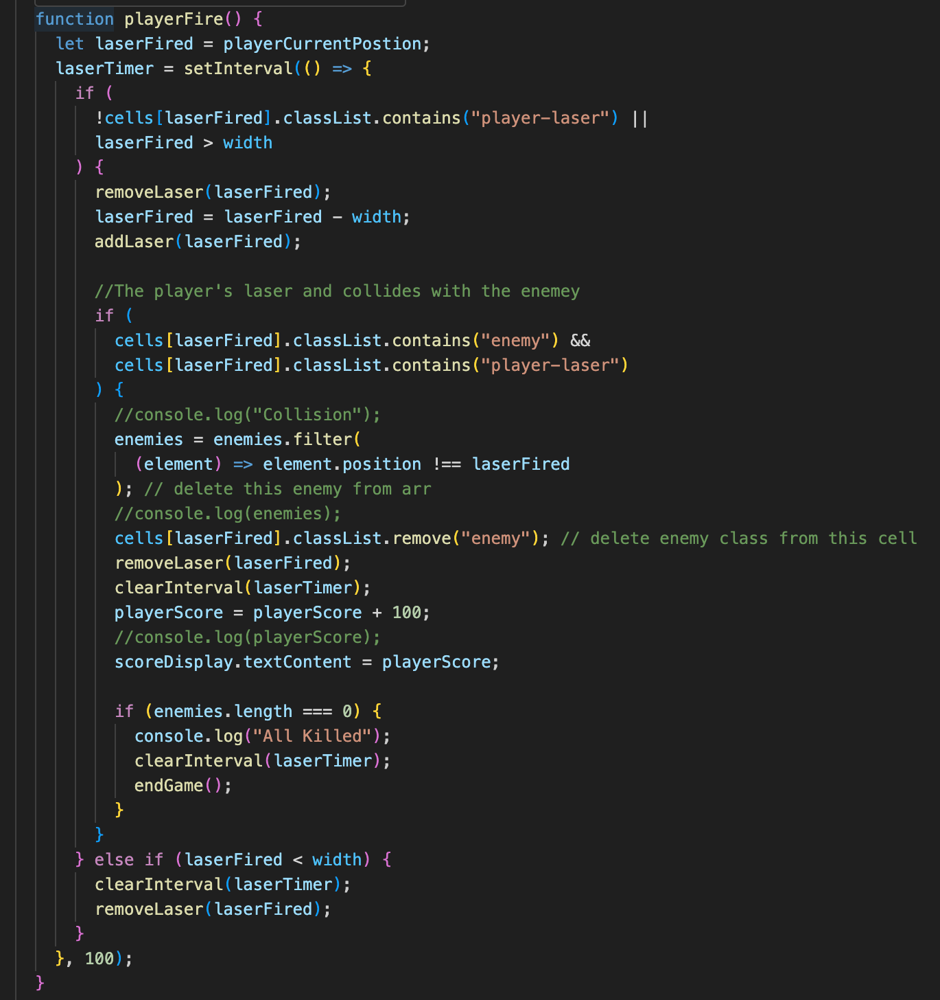
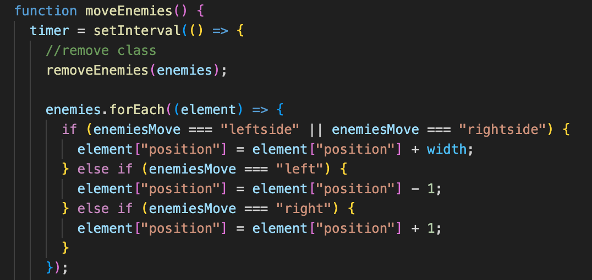
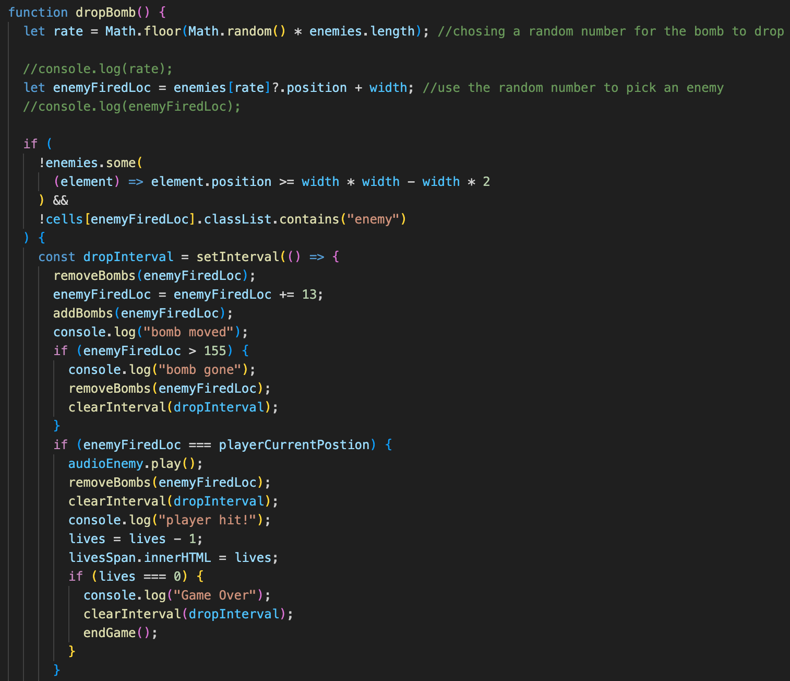

# General Assembly-Project 1 SPace Invaders

For project 1, I was given the task to create a grid game using HTML, JavaScript and CSS. This is reviewing the work that was learnt on the course during the first 3 weeks.
There were 10 options of games to choose and I chose to make a space invaders game that is called Tie Fighter Attack. The goal is to clear all the enemies before they reach the ground or shoot the player 3 times.

## Deployment Link

[Tie Fighter Attack](https://hoenigma.github.io/SEB-Project-1/)

## Code Installation

To get this project up and running on your local machine, follow these steps:

1. Clone the repository: git clone git.github.com: hoenigma/seb-project-1.git
2. Install the packages: npm i
3. Run the project: npm run dev

## Timeframe

This was a solo project that I had a week to complete.
My version is very similar to space invaders but with a Star Wars styling.

## Brief

The brief for this project was to create a browser game created on a grid.
The requirements and deliverables for this game were:

- Create a working game
- Design logic and display if the player wins/lose
- Include separate files for HTML, CSS and JavaScript
- Deploy the game online (done through github)

There were a few options given for what game I could make and I decided to build Space Invaders. For Space Invaders I had a couple more requirements which were:

- The player should be able to clear at least one wave of aliens
- Player score should be displayed at the end of the game

I was given necessary deliverables for this project which, were the following:

- A working game, built by you, hosted somewhere on the internet
- A link to your hosted working game in the URL section of your Github repo
- A git repository hosted on Github, with a link to your hosted game, and frequent commits dating back to the very beginning of the project
- A readme.md file with explanations of the technologies used, the approach taken, installation instructions, unsolved problems, etc. (completed post project)

## Technologies used

### HTML

- Header using Star Wars font found at "https://fonts.cdnfonts.com/css/star-wars"
- Div containing score, lives, start button, reset button and instructions
- Grid with a 169 celss (13 x 13 grid)

### CSS

- Grid and information Div was given flexbox
- Created classes for: Player Ship, Enemy Ships, Player laser and Enemy bomb

### JavaScript

- Assigning keys to move player
- Assign space to fire laser
- Move the enemies via `setInterval`
- Enemies drop bombs via `setInterval`
- Click to start and reset gane
- `Endgame` for 3 different scenarios- Player wins, enemy reaches bottom and enemy kills player

## Planning

Below is a wireframing drawn on paper:

The drawing shows how I wanted the page to look. A heading would be at the top with a navbar under to show scores, lives, a start and reset button. The main grid would hold the game.

Pseudocoding was written for this project splitting it up to these sections:

- Creating the grid
- Adding and moving the player on the grid
- Firing the laser for the player and laser collision
- Adding and moving the enemies
- Firing the bomb for the enemies
- Endgame

## Build Process

## What Happened each Day

Day 1:
I started by creating a wire frame and writing Pseudo code for the project.
The HTML is a very simple structure and was made to store the flex boxes.
I also made a grid box in javascript to store the game in.

Day 2:
Decided to do a Star Wars theme for the game so found assets including the font and images.
Styled up the HTML making flex boxes and making the classes for the assets.
I then started on Javascript where I started linking the DOM and gave the player movement abilities.

Day 3:
I gave the player ability to fire using the space bar.
Gave the enemies function to move and waht to do when they reach the edge of the grid.

Day 4:
After moving the enemies, they were giving the function for a random one to drop a bomb.
One end game fucntion was created for the 3 end game scenarios and to show the high score.

Day 5:
On the last day, I had to sort out some problems with the end game and clear up some of the code.
I had some time so I added some audio for the lasers and styled up the start and reset buttons.

## Detailed Look at Features

### Game Start Screen

Game starts with all the player and ememies on the screen.
In the bar there is the score, lives, start and reset button.

### Player movement

The player ship is assinged the keycode for the left and right arrows keys.
To make sure the ship doesn't go thrpugh the end of the grid, statement were made to stop this:

- On the left if the position of the ship divided by the width had no remainder, it was on the far left grid cell and couldn't go any more left
- On the right if the position of the ship divided by the width had a remainder of width -1, it was on the far right grid cell and couldn't go any more right.

  

### Player firing

Assigned the player's laser to be fired to the spacebar.
The laser is on a `setInterval` this will make it move up the cells once fired. When fired a sound will play.
Laser moves through each cell by having it:

- Remove class of laser from original cell.
- Moving it up a cell by minusing the width.
- Add the class if lazer to the new cell.

If the laser hits an enemy, the enemy will dissapear (remove class of enemy) and the laser will stop moving and be removed (clearInterval and remove class of lazer). When hit, player will gain 100 points and this is shown on screen

If the lazer makes it to the top of the grid (lazerFired < width) the lazer will be removed (clearInterval and remove class of lazer).

### Enemy movement

The enemies move due to the varaible enemiesMove.
The start of the game they are moving left (value of "left") meaning they will all go -1 cells. Like the player movement, the class needs to be removed from original cell, moved then added to the new cell.

When the enemies located on the far left reach the end of the grid, its given the value of "leftside" and a counter called moveDown goes up by 1. This makes all the enmies move down 1 cell (+ width). WHen it goes down the moveDown counter becomes 2 and as moveDown is now bigger than 1 the enemiesMove is now "right" and the moveDown counter is rested. This repeates when the enemies hit the far right side and the direction changes.

### Enemy Firing

To get the bombs to drop, I firstly created a random number generator for the amount of enemies in the enemies array.
This is then put into a new variable (enemyFiredLoc) to say the enemy at the postion of the random number, + width (so its below the enemy) a bomb class.

Like player lazer the bomb moves down the grid by removing the class, moving the bomb and adding the class to the new cell. If the bomb reaches the bottom of the grid and doesn't hit the enemy it will be removed. If the bomb hits the player an audio sound will play, the player will lose a live (shown on screen) and the bomb will be removed.

### Endgame Scenarios

There are 3 end game scenarios:

1. The player removes all the enemies.
2. The enemies reach the bottom of the grid.
3. The enemies shoot the player 3 times.

Each of the senarios will create an alert either saying:
`Your score was ${playerScore} but the high score is ${highScore}` or (`New high score! ${playerScore}`);
High Score is storeed in local storage.

## Key Learnings

Only having a week on JavaScript I was still learning how it functioned and the best way to structure my code. With help from the instructors, we spoke about why certain code has to be moved around and placed before other sections.
One of the challenges I had with CSS was with flex boxes and how to organise multiple ones in the way I wanted to display them. By trial and error and using resources like w3 schools, I was able to get them to work.

This project I had to manage myself and make sure I was hitting the requirements that I had to reach for this project. To do this, each day I would give myself a goal to reach to complete certain functions and check it off the list in my pseudo code.

## Challenges and Wins

To get the enemies to move down was a challenge as I had to make sure that any enemy that reached the left/right side of the grid was able to get all the enemies to move down and for the enemies to change direction. For changing direction, I had the variable enemiesMove which I could say is left or right and set an if/else if statement to say what to do when the variable was left or right. For moving the enemies down, I created a new variable called moveDown which at the start I had to set 0 so the enemies would not move down at the start.

To get any enemy to move down and change direction I used the filter function to say an enemy that has a position which is at either end of the grid cell to move down and change direction. A problem here was when I set the enemies to move the opposite way and move down, the enemies would then move down again as the moveDown varaibe was still at 1( as the enemies was still at the side). TO get it so the enemies wouldn’t move down again, I had to create new values called leftside and rightside. This meant at first the enemies would move down 1 cell, have the value changed to leftside/rightside and then either change direction to left or right and reset moveDown to 0 to stop it moving down.

When making the endGame function, I had problems with lazers and enemies carrying on moving after the game had finished. This was due to the setInterval carrying on once the message showing the player score was removed.
To fix this I had to add clearInterrval functions to the bombs for when the lives were 0 or the ships were at the bottom of the page. To stop the enies from moving I used the removeEnemies function I made earlier and added it to the endGame function so there would be no enemies when the game ended.

## Future Improvements

- Create a level 2
- Create a modal for endGame

## Bugs

If too many lasers are fired, they can get stuck on the screen.
I would look to fix this by adding a restriction for how many lasers could be on the screen to help with the game running. In the playerFire function I could add a new variable called numberOfLasers and everytime one is fired the counter goes up by one. When the laser hits an enemy or reaches the enmd fo the screen the counter would go down by 1. Then an if statement would be added saying if numberOfLasers === 4, player can’t fire, Else, run the code for playerFire.
